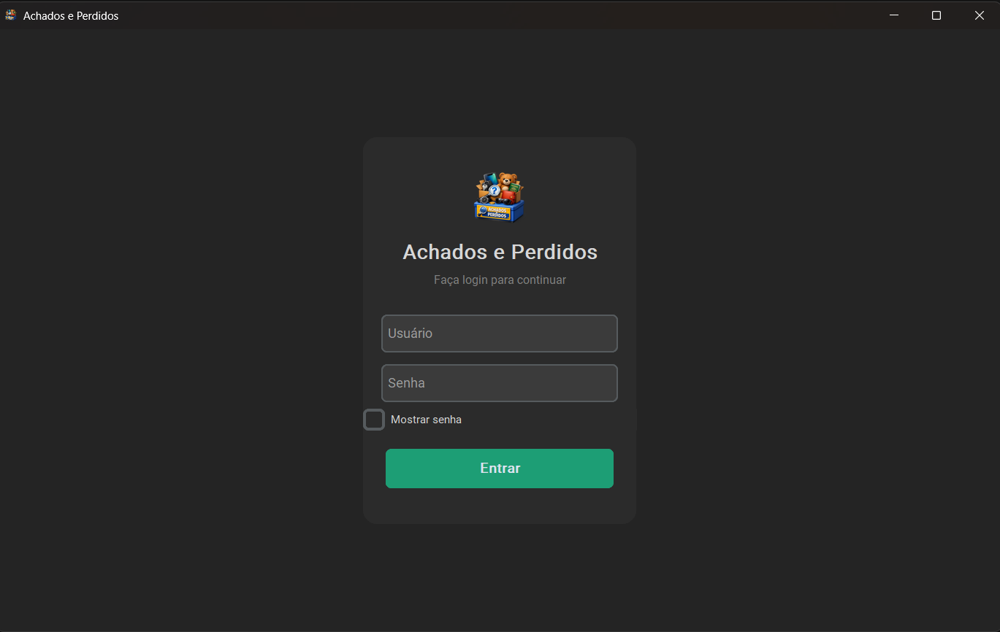
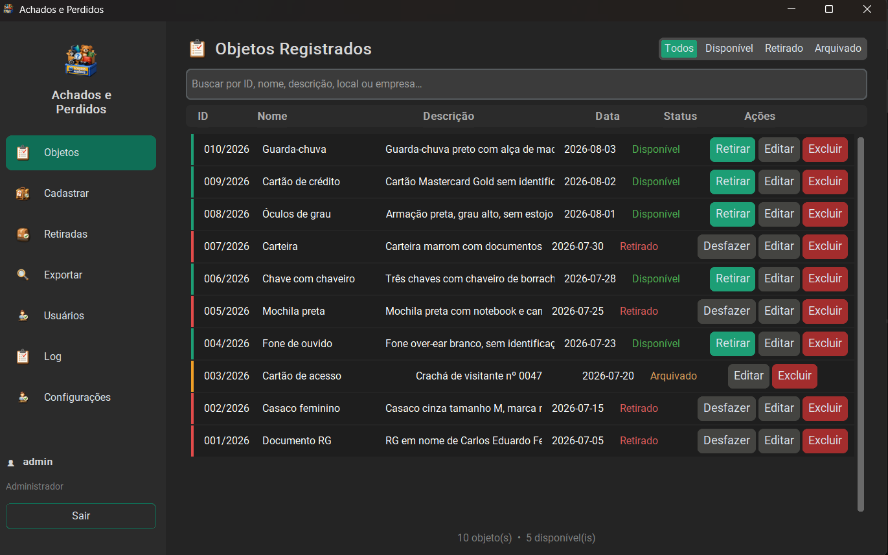
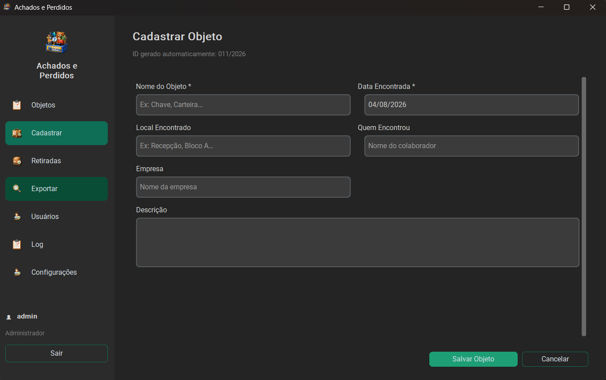
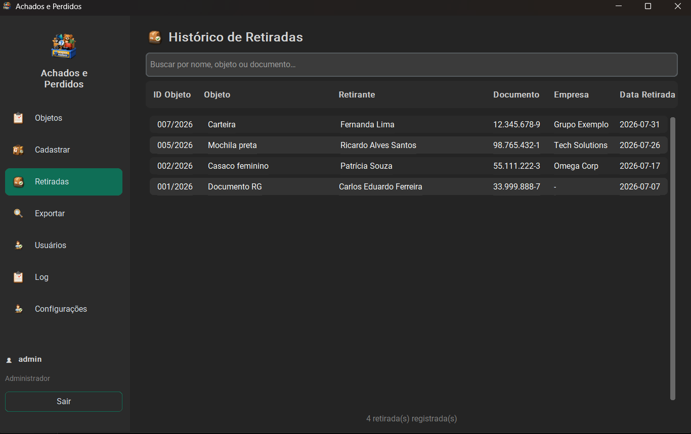
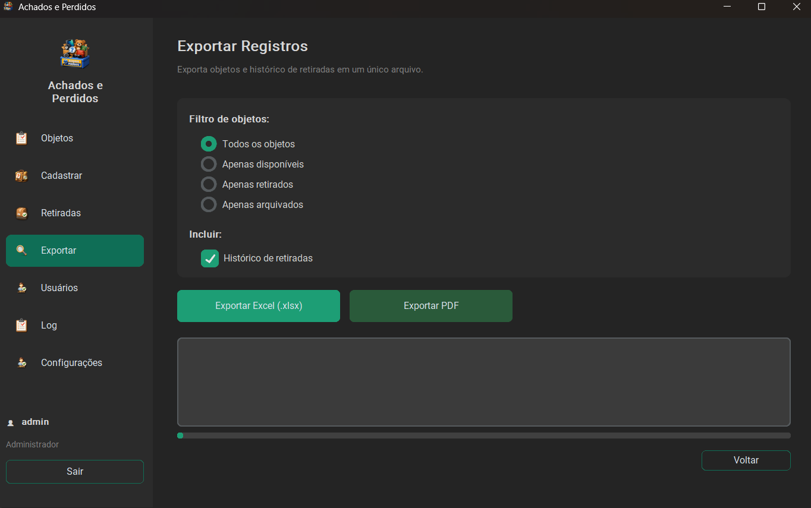
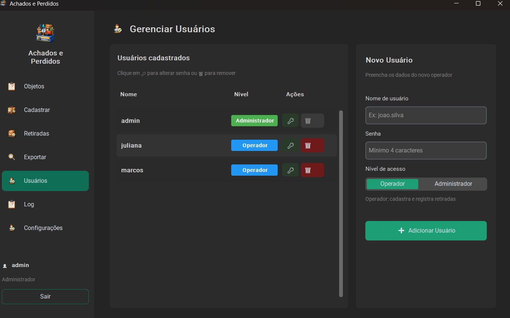
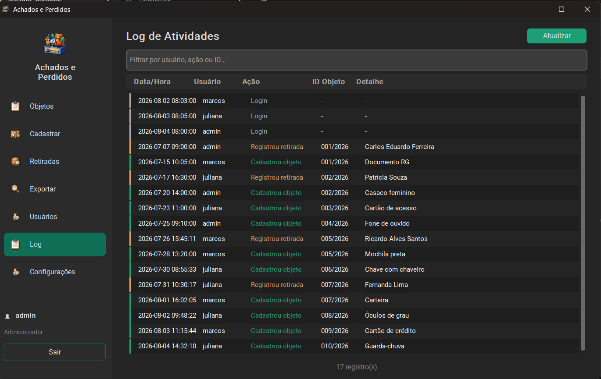
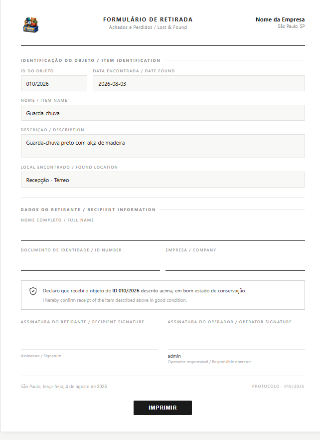
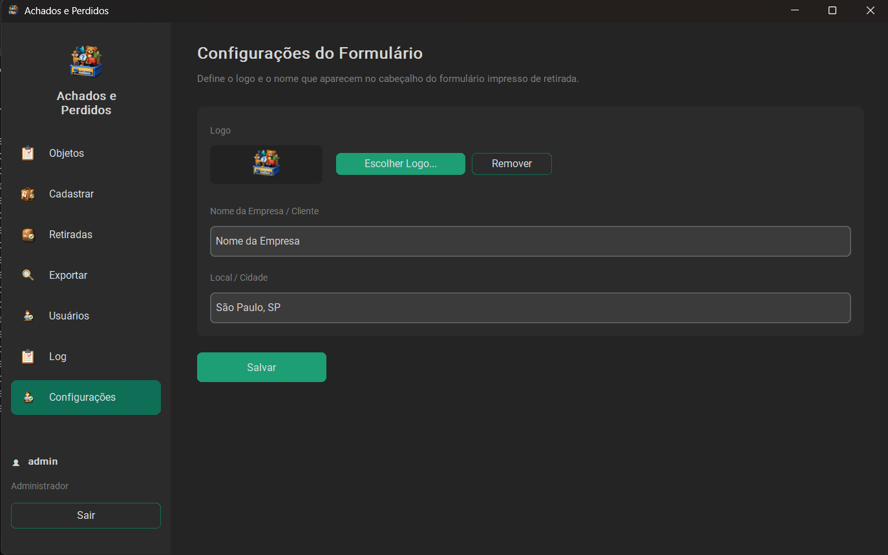

# 🧳 Achados e Perdidos

Sistema desktop de gerenciamento de achados e perdidos para edifícios comerciais, com controle de objetos encontrados, retiradas e histórico completo de atividades.


---

## 📸 Interface

<details>
<summary><b>Login</b></summary>


</details>

<details>
<summary><b>Objetos Registrados</b></summary>


</details>

<details>
<summary><b>Cadastrar Objeto</b></summary>


</details>

<details>
<summary><b>Histórico de Retiradas</b></summary>


</details>

<details>
<summary><b>Exportar Registros</b></summary>


</details>

<details>
<summary><b>Gerenciar Usuários</b></summary>


</details>

<details>
<summary><b>Log de Atividades</b></summary>


</details>

<details>
<summary><b>Formulário de Retirada (impresso)</b></summary>


</details>

<details>
<summary><b>Configurações do Formulário</b></summary>


</details>

---

## 📋 Funcionalidades

- Cadastro de objetos com ID automático por ano (`001/2026`, `002/2026`...)
- Registro de retiradas com comprovante para impressão (bilíngue PT/EN)
- Configuração de logo e nome da empresa direto pela interface, sem alterar código
- Histórico completo de retiradas
- Arquivamento automático de objetos disponíveis há mais de 90 dias
- Exportação de relatórios em Excel e PDF
- Gerenciamento de usuários com dois níveis de acesso: Administrador e Operador
- Senhas protegidas com hash SHA-256
- Log de auditoria: registra toda ação com usuário e horário
- Banco de dados local SQLite — sem servidor, sem internet

---

## 🖥️ Requisitos

- Python 3.10 ou superior
- Windows 10/11

---

## 🚀 Instalação

```bash
# 1. Clone o repositório
git clone https://github.com/KeilaSuellen/Lost-Found.git
cd Lost-Found

# 2. Instale as dependências
pip install -r requisitos.txt

# 3. Execute
python main.py
```

---

## 📦 Gerar executável (.exe)

```bash
pip install pyinstaller
pyinstaller --onefile --windowed --icon=assets/icon.ico --name="Achados e Perdidos" main.py --clean
```

O executável será gerado em `dist/`.

> ⚠️ Use sempre a flag `--clean` ao gerar uma nova versão, ou apague manualmente `build/` e `dist/` antes, para evitar erros de cache no executável final.

---

## 🗄️ Banco de dados

| Modo | Local do arquivo |
|------|-----------------|
| Desenvolvimento (`python main.py`) | Pasta do projeto |
| Executável (`.exe`) | `%LOCALAPPDATA%\AchadosPerdidos\` |

Para migrar dados entre computadores, copie o arquivo `.db` para o mesmo caminho no novo PC.

> 🔒 O banco contém dados pessoais dos retirantes. Nunca suba o `.db` para o Git — ele já está no `.gitignore`.

---

## ⚙️ Configuração do formulário

Em **Configurações** é possível definir:

- Logo exibido no cabeçalho do comprovante impresso (PNG/JPG)
- Nome da empresa/cliente
- Cidade exibida no rodapé

Os valores ficam salvos no banco (tabela `config`) e aplicados automaticamente no formulário de retirada.

---

## 📁 Estrutura do projeto

```
Lost-Found/
├── main.py                      # Ponto de entrada
├── utils.py                     # Utilitários e resource_path
├── requisitos.txt               # Dependências
├── .gitignore
├── assets/                      # Ícones e imagens
│   ├── icon.ico
│   └── logo_vs.b64
├── database/
│   └── db.py                    # SQLite — todas as operações de dados
├── views/
│   ├── login_view.py
│   ├── home_view.py
│   ├── lista_objetos_view.py
│   ├── cadastro_objeto_view.py
│   ├── retirada_view.py
│   ├── historico_retiradas_view.py
│   ├── exportacao_view.py
│   ├── usuarios_view.py
│   ├── log_atividades_view.py
│   └── configuracao_view.py
└── docs/                        # Screenshots
    ├── login.png
    ├── objetos.png
    ├── cadastro.png
    ├── retiradas.png
    ├── exportar.png
    ├── usuarios.png
    ├── log.png
    ├── formulario.png
    └── configuracoes.png
```

---

## 🛠️ Tecnologias

| Biblioteca | Uso |
|------------|-----|
| [CustomTkinter](https://github.com/TomSchimansky/CustomTkinter) | Interface gráfica |
| [SQLite](https://www.sqlite.org/) | Banco de dados local |
| [Pillow](https://python-pillow.org/) | Processamento de imagens |
| [Pandas](https://pandas.pydata.org/) + [OpenPyXL](https://openpyxl.readthedocs.io/) | Exportação Excel |

---

## 📄 Licença

Projeto de uso interno.
